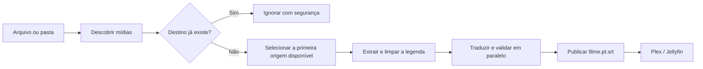

<div align="center">
  
</div>

<div align="center">

[](https://github.com/antonioneris/subgen/releases/latest)
[](https://github.com/antonioneris/subgen/actions/workflows/ci.yml)
[](https://go.dev/)
[](#instalação)
[](LICENSE)

**Transforme legendas embutidas ou arquivos SRT em traduções naturais, prontas para Plex e Jellyfin — sem sair do terminal.**

[Instalação](#instalação) · [Primeiros passos](#primeiros-passos) · [Comandos](#comandos) · [Automação](#automação-e-servidores) · [Contribuir](#contribuindo)

</div>

---

## Por que o Subgen?

Traduzir uma biblioteca de mídia deveria ser simples: escolher os idiomas, apontar para uma pasta e deixar o programa cuidar do resto. O Subgen encontra a melhor faixa disponível, remove ruído de legendas ASS, traduz em paralelo e publica um SRT com o nome que os players realmente reconhecem.

```console
$ subgen translate ./MinhaSerie

Minha Serie · automática · en · prioridade 1/3 · ENG Full
◆ Minha Serie - S01E03.mkv · faixa 6 (en → pt-BR)
  403 legendas · ~16.4k tokens · 4 chamadas em paralelo
  ████████████████████████████████████████ 100%
✓ Tradução salva Minha Serie - S01E03.pt.srt
  custo OpenRouter: US$ 0.004370
```

<table>
  <tr>
    <td width="33%"><strong>🎯 Uma faixa por mídia</strong><br>Escolhe a primeira origem disponível por prioridade e nunca traduz todas as faixas por acidente.</td>
    <td width="33%"><strong>⚡ Rápido por padrão</strong><br>Divide pelo volume de tokens e executa chamadas em paralelo, preservando contexto entre as partes.</td>
    <td width="33%"><strong>📺 Pronto para o player</strong><br>Gera <code>filme.pt.srt</code>, o padrão reconhecido por Plex, Jellyfin e outros players.</td>
  </tr>
  <tr>
    <td><strong>💰 Custo transparente</strong><br>Mostra tokens e custo por legenda, total da execução e previsão antes de traduzir.</td>
    <td><strong>🛡️ Originais preservados</strong><br>Nunca modifica o vídeo ou a legenda original e só publica arquivos totalmente validados.</td>
    <td><strong>🖥️ CLI amigável</strong><br>Configuração guiada, seleção visual, cores, spinner, progresso e mensagens úteis.</td>
  </tr>
</table>

## Visão geral



- Traduz `.srt`, uma mídia individual ou uma biblioteca inteira.
- Extrai legendas textuais embutidas em MKV, MP4, M4V, MOV, AVI, WebM e TS.
- Usa uma lista ordenada de idiomas de origem, como `en → fr → ja`.
- Prefere faixas `Full/Complete`, evita `Forced` e rebaixa SDH/CC automaticamente.
- Consolida milhares de quadros repetidos e desenhos gerados por efeitos ASS.
- Usa DeepSeek direto ou qualquer modelo compatível disponível no OpenRouter.
- Valida IDs, quantidade e conteúdo antes de salvar; respostas incompletas nunca viram arquivos finais.
- Exibe latência, velocidade, tokens e custo real quando o provedor os informa.
- Oferece `info`, `inspect`, `dry-run`, retries, streaming e gravação atômica.

## Instalação

Não é necessário instalar Go. As releases contêm binários para macOS, Linux e Windows em Intel/AMD e ARM64.

### macOS e Linux

```bash
curl -fsSL https://raw.githubusercontent.com/antonioneris/subgen/main/install.sh | sh
```

### Windows

Abra o PowerShell:

```powershell
irm https://raw.githubusercontent.com/antonioneris/subgen/main/install.ps1 | iex
```

### Plataformas publicadas

| Sistema | x64 / amd64 | ARM64 |
|---|:---:|:---:|
| macOS | ✅ | ✅ Apple Silicon M1–M4 |
| Linux | ✅ | ✅ |
| Windows | ✅ | ✅ |

O instalador:

1. Detecta o sistema e o processador.
2. Baixa a release correta.
3. Valida o arquivo com SHA-256.
4. Instala o executável permanentemente no `PATH`.
5. Tenta instalar FFmpeg quando ele ainda não está disponível.

No macOS com Homebrew, o binário é instalado no prefixo do Homebrew. Nos demais Unix, em `/usr/local/bin`. No Windows, em `%LOCALAPPDATA%\Programs\subgen`, com atualização permanente do `PATH` do usuário.

<details>
<summary><strong>Instalação manual a partir do código</strong></summary>

Requer Go 1.24 ou mais recente e FFmpeg:

```bash
git clone https://github.com/antonioneris/subgen.git
cd subgen
go test ./...
go build -o bin/subgen ./cmd/subgen
```

</details>

## Primeiros passos

### 1. Configure o Subgen

```bash
subgen config
```

O assistente conduz toda a configuração:

```text
◆ Configuração guiada

? Qual provedor você quer usar?
  DeepSeek direto
› OpenRouter

? Chave de acesso: ••••••••••••••••
? Idioma de saída: pt-BR
? Idiomas de origem por prioridade: en, fr, ja
? Modelo: deepseek/deepseek-v4-flash
```

As escolhas são permanentes. O arquivo é salvo no diretório nativo de configuração do sistema com acesso restrito e escrita atômica. Não é necessário usar `export` ou repetir a configuração ao abrir outro terminal.

Comandos auxiliares:

```bash
subgen config show   # mostra a configuração e mascara as chaves
subgen config path   # mostra onde o arquivo foi salvo
```

### 2. Veja o que será necessário

```bash
subgen info /caminho/da/biblioteca
```

O relatório é somente leitura. Ele identifica o que já está pronto e calcula a fonte, falas, tokens, chamadas e custo estimado do restante, sem executar traduções.

```text
╭─────────────┬──────────────────────────┬─────────────────────────┬───────┬────────────┬──────────┬──────────────╮
│ Status      │ Mídia                    │ Fonte                   │ Falas │ Tokens E/S │ Chamadas │ Estimativa   │
├─────────────┼──────────────────────────┼─────────────────────────┼───────┼────────────┼──────────┼──────────────┤
│ ✓ pronta    │ Minha Série · S01E01     │ externa · pt            │ —     │ —          │ —        │ —            │
│ → traduzir  │ Minha Série · S01E02     │ en · faixa 6 · ENG Full │ 403   │ 16.4k/12.2k│ 4        │ US$ 0.004370│
╰─────────────┴──────────────────────────┴─────────────────────────┴───────┴────────────┴──────────┴──────────────╯
```

### 3. Traduza

```bash
subgen translate /caminho/da/biblioteca
```

É isso. Mídias que já possuem a legenda de destino são ignoradas e apenas os arquivos pendentes entram na fila.

## Comandos

### `subgen translate`

Traduz um SRT, uma mídia ou todos os vídeos de uma pasta:

```bash
subgen translate filme.mkv
subgen translate legenda.srt --to pt-BR
subgen translate ./Temporada --from en,fr,ja --parallel 6
```

Para visualizar o plano sem chamar a IA:

```bash
subgen translate ./Biblioteca --dry-run
```

### `subgen info`

Faz o inventário e estima o trabalho pendente:

```bash
subgen info ./Biblioteca
subgen info ./Biblioteca --to pt-BR --from en,fr,ja
```

Ele reconhece sidecars como `.pt.srt`, `.pt-BR.srt`, `.pt.sdh.srt` e faixas de destino embutidas. Quando o OpenRouter está configurado, consulta o preço atual do modelo para estimar o valor em dólar.

### `subgen inspect`

Lista as faixas embutidas sem traduzir:

```bash
subgen inspect filme.mkv
```

```text
faixa 3   idioma=fre   codec=ass       texto
faixa 4   idioma=eng   codec=subrip    texto — ENG Full
faixa 5   idioma=eng   codec=subrip    texto — SDH
faixa 6   idioma=por   codec=hdmv_pgs  gráfica/OCR
```

### Opções de tradução

| Opção | Descrição | Padrão |
|---|---|---|
| `--to`, `-t` | Idioma de destino | Configuração salva |
| `--from` | Origens por prioridade, por exemplo `en,fr,ja` | Configuração salva |
| `--provider` | `deepseek` ou `openrouter` | Configuração salva |
| `--model` | Modelo usado pelo provedor | DeepSeek V4 Flash |
| `--parallel` | Chamadas simultâneas, de 1 a 8 | `4` |
| `--batch` | Tamanho manual das partes; `0` calcula por tokens | `0` |
| `--timeout` | Tempo máximo sem receber dados da API | `15m` |
| `--retries` | Novas tentativas em falhas temporárias | `3` |
| `--track` | Seleção explícita da faixa embutida | Automática/visual |
| `--recursive` | Busca em subpastas | `true` |
| `--clean-effects` | Limpa animações e desenhos ASS em SRT avulso | Automático em mídia |
| `--dry-run` | Planeja sem chamar a API | `false` |
| `--overwrite` | Permite substituir uma saída existente | `false` |

## Seleção inteligente de idioma

Configure as origens como uma lista de fallback:

```text
en → fr → ja
```

Para cada vídeo, o Subgen:

1. Procura uma faixa completa em inglês.
2. Se não encontrar, tenta francês.
3. Depois tenta japonês.
4. Traduz somente a primeira opção encontrada.
5. Segue imediatamente para o próximo vídeo.

Entre várias faixas do mesmo idioma, a preferência é `Full/Complete`, depois a versão comum e por último SDH/CC. Faixas `Forced` não são consideradas legendas completas. Adicione `auto` ao final da lista se quiser abrir o seletor visual quando nenhum idioma preferido estiver disponível.

## Plex, Jellyfin e nomes de arquivos

Uma mídia chamada:

```text
Ballerina (2025).mkv
```

gera:

```text
Ballerina (2025).pt.srt
```

O nome-base associa a legenda ao vídeo e o código ISO 639-1 permite que Plex e Jellyfin identifiquem o idioma. O destino regional `pt-BR` continua sendo enviado à IA; apenas o nome do sidecar usa `pt` para máxima compatibilidade.

As saídas são UTF-8, legíveis pelo servidor de mídia e gravadas atomicamente. Nomes antigos como `.pt-BR.track5.srt` são migrados quando encontrados.

## Velocidade, contexto e custo

Capacidade de contexto não significa velocidade de geração. Em vez de enviar uma legenda longa em uma única requisição, o Subgen cria partes de aproximadamente 4,5 mil tokens e executa até quatro chamadas simultâneas por padrão.

Oito falas antes e depois de cada parte são usadas como contexto somente leitura, ajudando a preservar nomes, tom e continuidade. O arquivo só é publicado quando todas as partes passam pela validação.

```text
desempenho OpenRouter · primeiro trecho 950ms · total 29.1s · 1.4 kB/s
custo OpenRouter: US$ 0.004370 · 16757 tokens de entrada · 13850 de saída
$ Custo total desta execução: US$ 0.004370
```

O custo mostrado depois da tradução é o valor informado pelo provedor. O valor de `subgen info` é uma estimativa baseada nos tokens previstos, no número de chamadas e no preço atual do modelo.

## Provedores

| Provedor | Modelo padrão | Vantagem |
|---|---|---|
| DeepSeek direto | `deepseek-v4-flash` | Menos uma camada de rede |
| OpenRouter | `deepseek/deepseek-v4-flash` | Roteamento por throughput, fallbacks e acesso a outros modelos |

As assinaturas de ChatGPT, Claude e serviços semelhantes não funcionam como créditos de API. Use uma chave criada no provedor escolhido.

Variáveis opcionais para ambientes efêmeros ou automações:

| Variável | Função |
|---|---|
| `DEEPSEEK_API_KEY` | Substitui temporariamente a chave DeepSeek salva |
| `OPENROUTER_API_KEY` | Substitui temporariamente a chave OpenRouter salva |
| `SUBGEN_PROVIDER` | Define `deepseek` ou `openrouter` |
| `SUBGEN_LANGUAGE` | Substitui o idioma de destino |
| `SUBGEN_MODEL` | Substitui o modelo |

## Automação e servidores

Execute `subgen config` uma vez com o mesmo usuário do serviço. Para execução não interativa, configure origens explícitas, como `en,fr,ja`, sem `auto`.

### Cron no Linux

O exemplo abaixo varre a biblioteca a cada hora. `flock` impede execuções simultâneas:

```cron
PATH=/usr/local/bin:/usr/bin:/bin
0 * * * * /usr/bin/flock -n /tmp/subgen-media.lock /usr/local/bin/subgen translate /srv/media >> "$HOME/subgen-cron.log" 2>&1
```

Teste antes:

```bash
/usr/local/bin/subgen info /srv/media
/usr/local/bin/subgen translate /srv/media --dry-run
```

O usuário do cron precisa ler os vídeos, escrever nas respectivas pastas e acessar o diretório exibido por `subgen config path`. Em Docker ou NAS, monte tanto a biblioteca quanto o diretório de configuração de forma persistente.

## Formatos e limitações

| Tipo | Exemplos | Suporte |
|---|---|:---:|
| Legendas textuais | SubRip/SRT, ASS/SSA, MovText | ✅ |
| Contêineres de mídia | MKV, MP4, M4V, MOV, AVI, WebM, TS | ✅ |
| Legendas gráficas | PGS, VobSub, DVB, XSUB | ⚠️ Requer OCR |

Legendas gráficas são imagens. O Subgen as identifica no `inspect`, mas não finge que consegue traduzi-las como texto. OCR assistido está no roadmap.

## Segurança e privacidade

- O original nunca é alterado.
- Timestamps e caminhos locais não são enviados como conteúdo para tradução.
- Chaves são salvas com permissão restrita e nunca aparecem inteiras em `config show`.
- Arquivos parciais não são publicados.
- IDs ausentes, duplicados ou inventados fazem a resposta ser rejeitada.
- Uma falha isolada numa pasta é registrada sem apagar traduções já concluídas.

> [!IMPORTANT]
> O texto das legendas selecionadas é enviado ao provedor de IA configurado. Consulte a política de privacidade e retenção do provedor antes de processar conteúdo sensível.

## Solução de problemas

<details>
<summary><strong><code>subgen: command not found</code></strong></summary>

Abra um novo terminal após a instalação e execute `subgen version`. No Windows, confirme que `%LOCALAPPDATA%\Programs\subgen` está no `PATH` do usuário. Reexecutar o instalador atualiza a instalação permanentemente.

</details>

<details>
<summary><strong>FFmpeg ou FFprobe não encontrado</strong></summary>

Reexecute o instalador ou instale FFmpeg pelo gerenciador do sistema. Os dois comandos precisam estar no `PATH`:

```bash
ffmpeg -version
ffprobe -version
```

</details>

<details>
<summary><strong>A legenda não aparece no Plex ou Jellyfin</strong></summary>

Confirme que ela está ao lado do vídeo e possui exatamente o mesmo nome-base:

```text
Filme.mkv
Filme.pt.srt
```

Depois, solicite uma nova varredura da biblioteca no servidor de mídia e verifique as permissões de leitura do arquivo.

</details>

<details>
<summary><strong>A tradução está demorando demais</strong></summary>

Observe as métricas de primeiro trecho e velocidade. Teste `--parallel 6` ou `--parallel 8`, respeitando os limites do provedor. Uma mídia curta ainda pode ter milhares de eventos ASS; a linha `limpeza ASS` mostra quantos blocos realmente foram mantidos.

</details>

<details>
<summary><strong>Nenhuma faixa foi encontrada no idioma configurado</strong></summary>

Use `subgen inspect filme.mkv` para conferir os idiomas e depois ajuste a lista em `subgen config`. Para fallback manual, coloque `auto` no final.

</details>

## Roadmap

- [ ] Memória de tradução local por hash para retomar trabalhos e reaproveitar falas.
- [ ] Glossário por série para nomes, pronomes e termos recorrentes.
- [ ] Controle de velocidade de leitura com alertas de CPS/CPL.
- [ ] Remux opcional em uma cópia MKV, nunca no original.
- [ ] OCR assistido para PGS e VobSub.
- [ ] Modo de revisão lado a lado.
- [ ] Pacotes Homebrew, WinGet e repositórios Linux.

Tem uma ideia? [Abra uma issue](https://github.com/antonioneris/subgen/issues/new) e conte o caso de uso.

## Desenvolvimento

```bash
git clone https://github.com/antonioneris/subgen.git
cd subgen
go test ./...
go test -race ./...
go vet ./...
go build -o bin/subgen ./cmd/subgen
```

Uma tag `v*` aciona a release automática, testa o projeto, compila as seis combinações de sistema/arquitetura, gera checksums e publica os arquivos no GitHub Releases.

## Contribuindo

Contribuições são bem-vindas — correções, documentação, novos idiomas, melhorias de UX e integrações com servidores de mídia.

1. Faça um fork do repositório.
2. Crie uma branch: `git switch -c feat/minha-melhoria`.
3. Implemente a mudança e adicione testes.
4. Execute `make test`.
5. Abra um Pull Request explicando o problema e a solução.

Evite incluir chaves de API, caminhos pessoais, mídia protegida ou legendas com direitos autorais nos commits e testes.

## Licença

Distribuído sob a licença [MIT](LICENSE). Você pode usar, modificar e distribuir o Subgen, preservando o aviso de copyright e a licença.

---

<div align="center">
  Feito em Go para quem prefere assistir à história, não lutar com a legenda.
  <br><br>
  <a href="https://github.com/antonioneris/subgen">⭐ Se o Subgen ajudou sua biblioteca, considere deixar uma estrela.</a>
</div>
